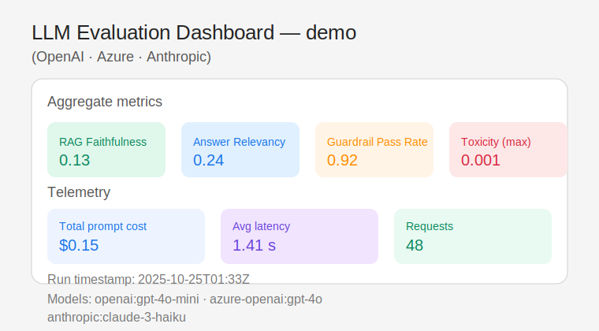

# LLM Evaluation Harness with Guardrails



## Overview
llm-eval-guardrails is a production-grade framework for building, guarding, and evaluating Retrieval-Augmented Generation (RAG) systems across multiple LLM providers. It ingests local corpora, enforces runtime guardrails (citations, toxicity, fact-check), orchestrates evaluations with TruLens & Ragas, and generates comprehensive regression-ready reports?ready to clone and run in minutes on Python 3.11.

### Key Features
- Pluggable providers (OpenAI, Anthropic, Azure OpenAI, Ollama, Mock) selectable via CLI.
- Local RAG stack using ChromaDB and sentence-transformers with ergonomic ingestion utilities.
- Guardrail suite: citation enforcement, toxicity filtering, fact-check retry loop, optional Guardrails.ai schema.
- Evaluation stack: TruLens heuristics, Ragas metrics, adversarial prompt suites, regression gates.
- Rich reports: JSON/CSV artifacts plus templated HTML dashboard (Plotly + Pandas) embeddable in docs/CI.
- Clean architecture with typed, tested modules, Typer CLI, Rich logging, Makefile and pre-commit hooks.

## Architecture
```mermaid
flowchart TD
    A[Corpus Files] -->|Ingest| B[Chroma Vector Store]
    B --> C[Retriever]
    C --> D[Prompt Builder]
    D --> E[Provider Abstraction]
    E --> F[Guardrail Runner]
    F -->|Pass| G[Answer + Metadata]
    F -->|Retry| D
    G --> H[Evals (TruLens, Ragas, Safety)]
    H --> I[Reporting Engine]
    I --> J[Reports JSON/CSV/HTML]
    K[Adversarial Suites] --> E
    L[Regression Baselines] --> H
```

## Quickstart
```bash
git clone https://github.com/your-org/llm-eval-guardrails.git
cd llm-eval-guardrails
cp .env.sample .env  # populate provider keys as available
make setup           # create venv + install deps + pre-commit hooks
make ingest          # build demo Chroma collection
make eval            # run QA suite with mock provider + guardrails
make adv             # execute adversarial suite
make report          # render HTML dashboard in reports/index.html
make regress         # compare run against baseline policy metrics
```
> ??? The `mock` provider ships with deterministic outputs so everything works end-to-end without external API keys.

### CLI Cheatsheet
```bash
# Ingest a different corpus
python -m evalguard.cli ingest --corpus ./data/corpus --collection demo

# Run QA evaluation across multiple providers
python -m evalguard.cli run --suite demo --models openai:gpt-4o-mini anthropic:claude-3-5-sonnet --k 4 --out ./reports/run_$(date +%s)

# Stress-test adversarial prompts
python -m evalguard.cli adversarial --suite all --models openai:gpt-4o-mini --out ./reports/adv_latest

# Rebuild HTML report from saved metrics
python -m evalguard.cli report --input ./reports/run_<ts>/aggregate.json --html ./reports/index.html

# Enforce regression gate vs. baseline policies
python -m evalguard.cli regress --current ./reports/run_<ts>/aggregate.json --baseline ./reports/baseline_metrics.json
```

All commands accept `--config` to point to a custom YAML settings file and `--models provider:model` pairs to switch between LLMs with a single flag.

## Configuration
Default configuration (`config.default.yaml`) is embedded in `evalguard.config`. Example:
```yaml
global:
  project_root: .
  data_dir: data
  persist_dir: .vectorstore
  reports_dir: reports
  random_seed: 42
  device: cpu

rag:
  retriever_top_k: 4
  chunk_size: 600
  chunk_overlap: 120
  collection: demo

guardrails:
  min_citations: 2
  toxicity_threshold: 0.2
  factcheck_required: true
  max_retries: 1
  rail_spec_enabled: false

policies:
  faithfulness: 0.75
  answer_relevancy: 0.70
  context_precision: 0.65
  context_recall: 0.60
  coherence: 0.70
  toxicity: 0.20

providers:
  mock:
    provider: mock
    model: deterministic
    temperature: 0.1
  openai:
    provider: openai
    model: gpt-4o-mini
    temperature: 0.1
  anthropic:
    provider: anthropic
    model: claude-3-5-sonnet-20240620
    temperature: 0.1
  azure-openai:
    provider: azure-openai
    model: gpt-4o
    temperature: 0.1
  ollama:
    provider: ollama
    model: llama3
    temperature: 0.1
```
Override any field by providing `--config path/to/config.yaml`; environment variables supply API keys (see `.env.sample`).

## Guardrails
1. **Citation Enforcement** ? Validates `[doc_id:chunk_id]` references against retrieved contexts with a minimum citation count.
2. **Toxicity Filter** ? Uses transformers pipeline when available, otherwise a fallback keyword heuristic, rejecting/redacting answers above threshold.
3. **Fact-Check Loop** ? Re-verifies using the model itself; one retry with corrective instructions if unfaithful.
4. **Optional Guardrails.ai** ? Applies a JSON schema rail for structured answers when `rail_spec_enabled` is true.

## Evaluation
- **TruLens heuristics** (faithfulness/coherence) via optional instrumentation; falls back to lexical heuristics when package unavailable.
- **Ragas metrics** (answer relevancy, faithfulness, context precision/recall) with graceful degradation.
- **Safety** evaluations combining toxicity scoring and YAML-based adversarial suites (jailbreaks, injections, refusal bait, and citation tampering probes).
- **Regression** gating compares aggregate metrics with `reports/baseline_metrics.json`, failing CI when policies are violated.

## Reports
Reports are dropped into the run directory and summarized in `reports/index.html`:
- JSON (`per_example.json`, `aggregate.json`, `metadata.json`)
- CSV exports
- HTML dashboard (Plotly charts, tables, status badges)
- Adversarial outcomes summary

The repository ships with a sample dashboard SVG for documentation and a baseline metrics JSON for regression gates.

## Testing & CI
- Unit tests (pytest) cover configs, citation parsing, vector store ingestion, pipeline guardrails, and evaluation fallbacks.
- Style & type checks via Ruff, Black (`--check`), and MyPy (`--strict`).
- GitHub Actions workflow (`.github/workflows/ci.yml`) runs lint, type-check, tests, an E2E smoke, report generation, and regression gating.
- Pre-commit hooks ensure consistent formatting and dependency security scans.

## Datasets
Demo corpus (`data/corpus`) describes a fictional product. QA dataset (`data/qa/demo_qa.jsonl`) holds 12 grounded examples with metadata and truths. Adversarial suites (`data/adversarial/*.yaml`) capture jailbreaks, prompt injections, refusal bait, and citation tampering probes.

## Contributing
See `CONTRIBUTING.md` for local development workflow, pre-commit usage, and community guidelines. MIT licensed; academic citation info lives in `CITATION.cff`.

---

### How to run (recap)
1. `cp .env.sample .env` and add provider keys.
2. `make setup && make ingest`
3. `make eval && make adv`
4. `make report`
5. `make regress` (after baseline update)

Enjoy evaluating safely-guarded RAG pipelines!

